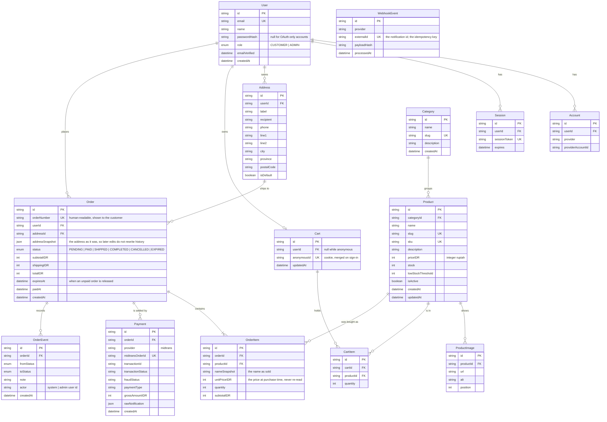
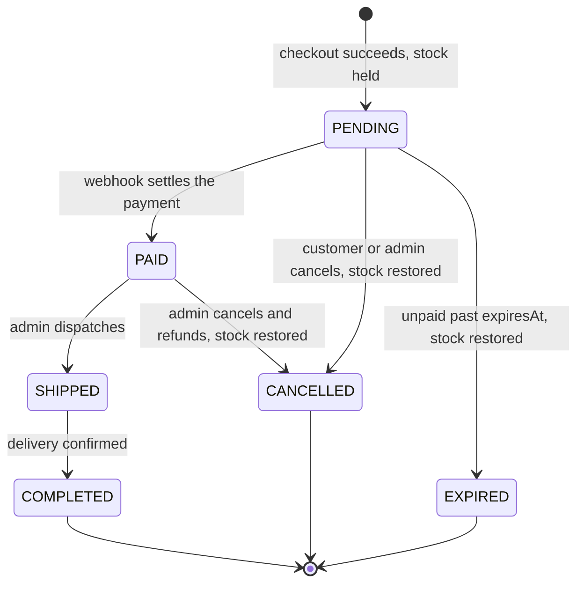

# ShopWave — build plan

The whole of ShopWave in one document: what it does, how the data is shaped,
where the code lives, and the order it gets built in.

---

## 1. Features

### Customer

| Feature        | What it means                                                                   |
| -------------- | ------------------------------------------------------------------------------- |
| Account        | Register, log in, log out. Session survives a refresh.                          |
| Catalogue      | Product grid with full-text search, category filter, sorting and pagination.    |
| Product detail | Images, description, price, live stock, add to cart.                            |
| Cart           | Persistent across sessions and devices once signed in. Quantity edits, removal. |
| Addresses      | Several saved addresses, one default, used at checkout.                         |
| Checkout       | Review, pick an address, place the order inside one transaction.                |
| Payment        | Midtrans Snap, sandbox. Settled by webhook, not by the browser redirect.        |
| Orders         | History, each order's items at the price paid, and live status tracking.        |

### Admin

| Feature          | What it means                                                      |
| ---------------- | ------------------------------------------------------------------ |
| Product CRUD     | Create, edit, archive. Image upload with a preview.                |
| Categories       | Create, rename, reorder, delete when empty.                        |
| Orders           | List, filter by status, advance status, cancel with stock restore. |
| Sales dashboard  | Revenue over time, orders by status, best sellers — as charts.     |
| Low-stock alerts | Products at or below their threshold, surfaced on the dashboard.   |

### System

- Order status flow: `PENDING → PAID → SHIPPED → COMPLETED`, with `CANCELLED`
  and `EXPIRED` as terminal exits.
- Unpaid orders expire after `ORDER_EXPIRY_MINUTES` and **restore the stock
  they were holding**.
- Stock is decremented inside the checkout transaction. Concurrent checkouts
  cannot oversell.
- The Midtrans webhook verifies its signature and processes idempotently.
- Money is integer rupiah, everywhere.

---

## 2. Database



### Decisions worth knowing

- **`OrderItem.unitPriceIDR` and `nameSnapshot`** exist so an order never
  changes when a product is edited or deleted. The `productId` stays as a link,
  not as a source of truth.
- **`Order.addressSnapshot`** does the same for shipping: editing a saved
  address must not silently rewrite where a past order went.
- **`WebhookEvent.externalId`** is unique, and that uniqueness _is_ the
  idempotency guarantee. A replayed Midtrans notification hits the constraint
  and stops.
- **`Cart.anonymousId`** lets a signed-out visitor fill a cart, which is merged
  into their account cart on sign-in.
- **`OrderEvent`** gives the customer a status timeline and gives us an audit
  trail for anything an admin changed by hand.

### The order state machine



Any transition not drawn above is rejected by the service. Stock returns on
exactly the three edges that say so, and returning it is part of the same
transaction as the status change.

---

## 3. Folder structure

```
shopwave/
├─ .github/
│  ├─ ISSUE_TEMPLATE/             bug report, feature request
│  └─ workflows/ci.yml            lint, type-check, test, build, e2e, commits
├─ docs/
│  ├─ PLAN.md                     this file
│  └─ BRAND.md                    the brand kit and how to apply it
├─ e2e/                           Playwright specs
├─ prisma/
│  ├─ schema.prisma
│  ├─ migrations/
│  └─ seed.ts
├─ public/
│  ├─ brand/                      the brand kit, as shipped
│  └─ uploads/                    product images in local dev (git-ignored)
├─ src/
│  ├─ app/
│  │  ├─ (shop)/                  storefront: catalogue, product, cart, checkout
│  │  ├─ (auth)/                  login, register
│  │  ├─ account/                 orders, addresses
│  │  ├─ admin/                   dashboard, products, categories, orders
│  │  ├─ api/
│  │  │  ├─ auth/[...nextauth]/
│  │  │  └─ webhooks/midtrans/    signature check, idempotent handling
│  │  ├─ layout.tsx               chrome, fonts, theme, toasts
│  │  ├─ error.tsx  not-found.tsx  loading.tsx
│  │  └─ globals.css              semantic tokens over the brand tokens
│  ├─ components/
│  │  ├─ ui/                      shadcn/ui primitives
│  │  ├─ layout/                  header, footer
│  │  └─ brand/                   logo lockups
│  ├─ server/
│  │  ├─ catalog/  cart/  checkout/  orders/  payments/  admin/
│  │  └─ …                        services: the business rules live here
│  ├─ lib/
│  │  ├─ db.ts                    the Prisma client singleton
│  │  ├─ auth.ts                  Auth.js configuration
│  │  ├─ env.ts                   Zod-validated environment
│  │  ├─ rate-limit.ts
│  │  ├─ site.ts                  names, links, brand asset paths
│  │  └─ utils.ts                 cn, formatIDR
│  └─ types/
├─ docker-compose.yml             Postgres for local development
├─ CLAUDE.md                      the rules, in full
└─ .env.example                   every variable, and the phase that needs it
```

---

## 4. Phases

Each phase is one branch and one pull request, reviewed and merged before the
next one starts.

| #   | Branch                   | Delivers                                                                                                          | Done when                                                             |
| --- | ------------------------ | ----------------------------------------------------------------------------------------------------------------- | --------------------------------------------------------------------- |
| 1   | `feat/foundation`        | Scaffold, tooling, hygiene files, Docker Compose, CI, the brand kit applied to the base layout. **← this PR**     | CI green on an empty app that builds, runs and looks like ShopWave.   |
| 2   | `feat/database`          | Prisma schema for the ERD above, first migration, seed data, the client singleton, a test database helper.        | `prisma migrate dev` and the seed run clean; model tests pass.        |
| 3   | `feat/auth`              | Auth.js: register, log in, log out, sessions, the `role` split, route protection, rate-limited login.             | A customer can register and stay signed in; admin routes reject them. |
| 4   | `feat/catalog`           | Catalogue grid, search, category filter, sort, pagination, product detail. Skeletons and empty states throughout. | Browsing works against seeded data, with tests for the query layer.   |
| 5   | `feat/cart`              | Persistent cart, quantity edits, anonymous-to-account merge on sign-in.                                           | A cart survives sign-out and sign-in; merge is covered by tests.      |
| 6   | `feat/checkout-payments` | Address management, checkout in a transaction with stock checks, Midtrans Snap, the signed idempotent webhook.    | A sandbox payment moves an order to `PAID`; concurrency test passes.  |
| 7   | `feat/orders`            | Order history, the status timeline, the expiry job with stock restore.                                            | An unpaid order expires on schedule and its stock comes back.         |
| 8   | `feat/admin`             | Admin dashboard: product CRUD with upload, categories, order management, sales charts, low-stock alerts.          | An admin can run the store without touching the database.             |
| 9   | `chore/hardening`        | Security headers, rate limits reviewed, a11y audit, Lighthouse pass, deployment guide, seeded demo data.          | Deployable, and the portfolio version is presentable.                 |

### What phase 1 deliberately leaves out

No Prisma schema, no Auth.js configuration and no Midtrans client are in this
phase. Each belongs to the phase that first uses it, so the foundation stays
something that builds and runs on its own rather than a pile of half-wired
dependencies. `.env.example` already lists their variables, marked with the
phase that introduces them.
